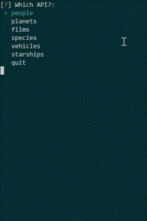
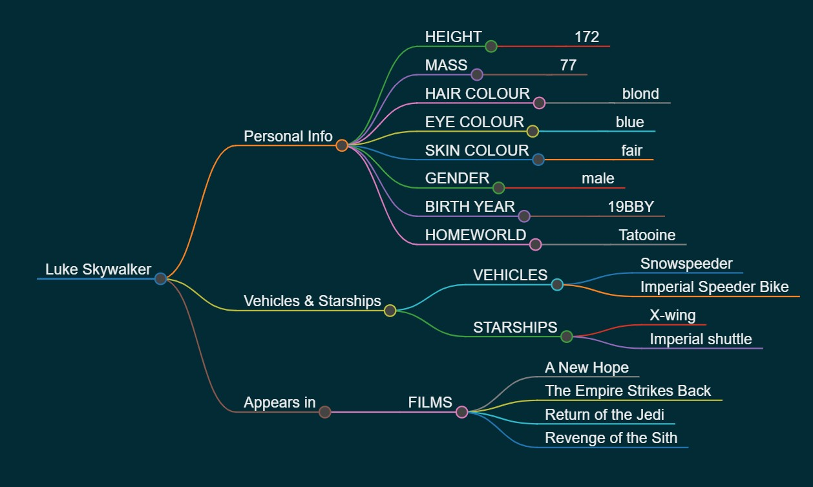

# Star Wars API Explorer

This explorer allows an easy way to interact with the open SWAPI "dev" database (sadly dated). Combined with MarkMap this tool allows you to visualise 
 - Characters
 - Planets
 - Spacecraft
 - Vehicles
 - Species
 - Films

## General Instructions

To use this tool kit the following steps are required. 

- Clone the "SWAPI-EXPLORER" repository
- Create a Virtual Environment
- Install req.txt file

First clone this repository

    git clone ...
    
Navigate to the newly cloned directory

    cd SWAPI-EXPLORER

Create a virtual environment, i like to use venv

    python3 -m venv venv

Now activate the virtual environment.

    source venv/bin/active

Finally install all requirements from the "req.txt" file

    pip install -r req.txt

## Best place to start

The infograb!

To help reduce the about of API calls being made. This script can pull down all information. 
You only need to pull down the information that you wish to search. This will be stored in the "localdata" directory.

e.g. 
If you only want information about Luke Skywalker, simply request the "people" data.

## MarkMap

This tool is designed to grab information an put it in to an interactive HTML MarkMap. 

 